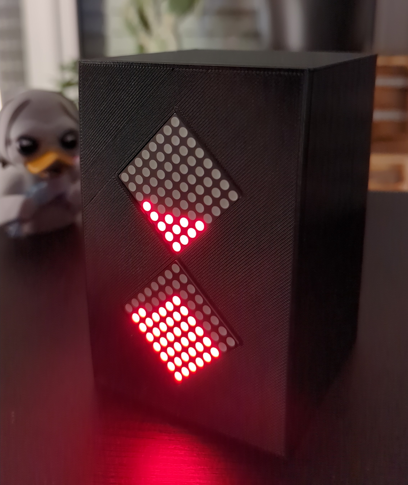

# Hourglass

This repo contains all you need to build your own digital pixel-hourglass, based on an Arduino Nano!

Prototype picture:

## Features

- Physically rotate the clock upside-down to reset the timer
- Press the button on the back to switch between different modi (endless, 1, 2, 5, 10, 15, 20, 30, 45 & 60 min)
- Have a cool retro-like feeling while measuring your time

## Contents

&rarr; [Code (Written in Arduino-C)](./hourglass)

&rarr; [Schematic](./assets/schematic.png)

&rarr; [3D-Printer files](./assets/models/)

## Hardware used

- Arduino Nano
- 2 LED Matrices
- Gyroscope Module
- Button
- Switch
- Resistor (1 kOhm)
- Battery 9V
- Cables
- 3D-Printer for the case

## Schematic

## 3D-Printer parts

All the used 3D printing parts can be found at [here](./assets/models/).
